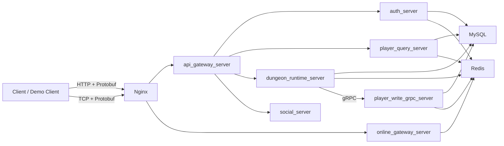
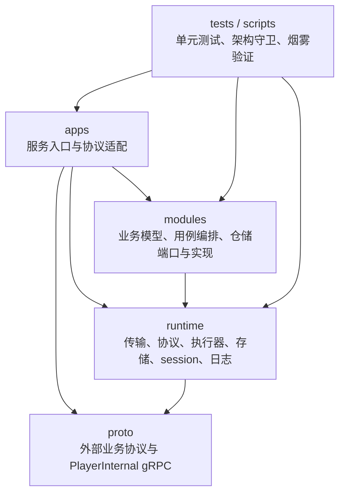
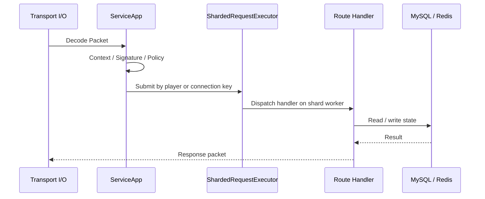

# Mobile Game Backend

## 项目定位

这是一个面向养成类手游后端场景的 C++ 服务端工程。项目围绕账号登录、在线网关、玩家初始化、副本进入、副本结算、玩家资产写入和基础社交查询组织代码，使用多进程服务拆分来表达不同业务边界。

主链可以概括为：

```text
客户端请求 -> 网关接入 -> 会话校验 -> 业务服务处理 -> 存储读写 -> protobuf 响应
```

## 核心能力

- 支持 HTTP + Protobuf 的主业务入口，覆盖登录、玩家初始化、玩家快照、副本和社交查询接口。
- 支持 TCP + Protobuf 的在线入口，处理 Gate 登录、重连、心跳、连接绑定和在线态记录。
- 支持 Redis session 颁发、校验、撤销和设备绑定。
- 支持玩家读路径的缓存优先查询，以及 MySQL 回源后的快照回填。
- 支持副本进入、活跃局恢复、结算、奖励状态查询和结算令牌校验。
- 支持玩家正式写链，通过 gRPC 完成体力预扣、回滚、奖励落账和缓存失效。
- 支持服务间请求签名、消息策略校验、请求上下文补齐和统一错误响应。
- 支持本地测试、Docker Compose 演示环境、服务健康检查和端到端烟雾验证。

## 完整业务链路



主业务请求先进入 `api_gateway_server`，网关解析 HTTP 请求体中的 protobuf 数据，从请求头提取 trace 与 token，完成 session 校验后按消息类型转发到对应业务服务。`online_gateway_server` 负责长连接在线态，与主业务 HTTP 链路分开处理。

## 架构分层



- `apps/`：每个可执行服务的启动、配置加载、依赖装配和请求适配。
- `modules/`：业务代码，按 `domain / application / ports / infrastructure / interfaces` 拆分。
- `runtime/`：通用运行组件，包括 TCP/HTTP/gRPC 支撑、协议包编解码、执行器、MySQL/Redis 连接池、session 和结构化日志。
- `proto/`：主业务 protobuf 协议和玩家写链 gRPC 协议。
- `tests/` 与 `scripts/`：覆盖服务用例、协议、网关校验、TLS、配置边界和端到端验证。

## 服务边界

| 服务 | 职责 |
| --- | --- |
| `api_gateway_server` | 接收 HTTP protobuf 请求，校验 session，签名后转发到业务服务 |
| `online_gateway_server` | 管理 TCP 长连接、Gate 登录、重连、心跳、在线态和多实例转发 |
| `auth_server` | 校验账号密码、记录登录审计、创建 Redis session |
| `player_query_server` | 查询玩家初始化视图和玩家快照，缓存优先、按需回源 MySQL |
| `player_write_grpc_server` | 提供玩家写链 gRPC，处理体力预扣、回滚、奖励落账和缓存失效 |
| `dungeon_runtime_server` | 编排副本进入、运行态上下文、结算令牌、奖励发放和状态查询 |
| `social_server` | 提供好友、会话和聊天记录查询的协议入口与统一响应结构 |

## 线程模型



- TCP 服务基于 Boost.Asio，连接会话负责读包、写包、空闲超时和断开回调。
- `ServiceApp` 统一处理中间件链：上下文补齐、可信请求校验、消息策略校验和日志记录。
- `ShardedRequestExecutor` 按 player 或 connection key 将请求投递到固定分片，保持同一玩家关键请求的处理顺序。
- HTTP 入口使用独立的 `HttpServer` 和 `HttpRouter`，将外部 HTTP 请求映射为服务间 protobuf 包。
- gRPC 写链由 `player_write_grpc_server` 提供，供副本服务调用玩家资产写入能力。
- MySQL 与 Redis 访问通过连接池复用连接，业务服务只依赖仓储接口或运行时封装。

## 核心模型

- `RequestContext` / `ResponseContext`：贯穿请求 ID、trace、token、player_id、account_id 和网关签名字段。
- `PacketHeader` / `Packet`：TCP 服务使用的消息包结构，包含 magic、version、message_id、body_len 和 request_id。
- `MessageId`：统一定义登录、玩家、副本、社交、在线网关和错误响应的消息编号。
- `Session`：Redis 中的账号会话模型，记录 account、player、过期时间、状态和设备标识。
- `PlayerState` / `HomeInitView`：玩家查询聚合模型，用于生成首页初始化数据和玩家快照。
- `DungeonContext`：副本运行态上下文，记录 session、关卡、体力消耗、随机种子、结算状态和奖励信息。
- `StageConfig`：关卡配置模型，提供进入等级、体力消耗、星级上限和奖励参数。

## 关键模块

- `runtime/transport`：TCP 服务端、客户端、TLS、PROXY Protocol、服务启动骨架和路由注册。
- `runtime/protocol`：包编解码、protobuf 映射、消息策略、上下文抽取、错误响应和 trusted gateway 签名。
- `runtime/execution`：按业务 key 分片的请求执行器，负责队列限制、分片选择和停机排空。
- `runtime/storage`：MySQL / Redis 客户端与连接池，支持读写库配置和 Redis TTL 操作。
- `modules/login`：账号查询、密码校验、登录审计和 session 创建。
- `modules/player`：玩家查询服务、玩家写服务、缓存仓储、MySQL 仓储和 gRPC 接口实现。
- `modules/dungeon_runtime`：副本进入、结算、幂等处理、补偿流程、玩家锁和运行态上下文。
- `modules/social`：社交查询请求的业务边界和响应模型。
- `apps/gateway`：在线网关共享的 session binding 和上游响应校验组件。

## 工程设计要点

- 网关层统一生成 request_id 和 trace_id，业务服务通过标准上下文拿到身份字段。
- 服务间请求使用 HMAC 签名和时间窗口校验，避免业务服务直接信任外部输入。
- 玩家查询和玩家写入拆分，查询路径优先读缓存，写入路径成功后失效缓存。
- 副本进入使用玩家锁、幂等键、运行态上下文和正式会话记录协同处理。
- 副本结算使用 settle token 校验请求来源字段，奖励发放通过玩家写链落账。
- `MessagePolicyRegistry` 将消息所需身份字段和执行 key 规则集中管理。
- 架构守卫脚本检查目录形状和跨层 include 关系，减少边界漂移。

## 主要技术实现

- C++17：核心服务、业务模块和运行时组件统一使用 C++17。
- Boost.Asio / Boost.Beast：用于 TCP 服务、上游 TCP 调用和 HTTP 接入。
- Protocol Buffers：定义外部业务请求与响应结构。
- gRPC：用于副本服务调用玩家写链。
- MySQL：保存账号、玩家主档、货币流水、副本会话和奖励状态。
- Redis：保存 session、玩家缓存、在线 presence、限流计数、副本上下文和玩家锁。
- OpenSSL：用于密码哈希、session token、HMAC 签名、结算令牌和 TLS 支撑。
- CMake：组织静态库、服务可执行文件、工具和测试目标。
- Docker Compose：启动 MySQL、Redis、业务服务、在线网关实例和 Nginx。

## 构建 / 运行 / 测试

准备系统依赖：

```bash
protobuf-compiler libprotobuf-dev libgrpc++-dev protobuf-compiler-grpc
libboost-system-dev libmysqlclient-dev libhiredis-dev libssl-dev
```

本地构建：

```bash
cmake --preset dev-debug
cmake --build --preset dev-debug --parallel
```

运行测试：

```bash
bash scripts/test.sh
```

启动演示环境并执行主链烟雾验证：

```bash
bash scripts/smoke.sh
```

聚焦登录、在线态、玩家初始化链路：

```bash
bash scripts/smoke_login_online_init.sh
```

综合验证入口：

```bash
bash scripts/verify.sh
```

## 目录速览

```text
apps/        服务入口、配置装配、协议适配
configs/     本地、演示、交付和生产配置样例
deploy/      Docker、Compose、Nginx、MySQL 初始化脚本
modules/     登录、玩家、副本、社交业务模块
proto/       protobuf 和 gRPC 协议定义
runtime/     网络、协议、执行器、存储、session、日志等通用组件
scripts/     构建、启动、验证和演示脚本
tests/       服务、协议、配置、TLS、网关和运行时测试
tools/       demo client、load client、service_check、password_tool
```
